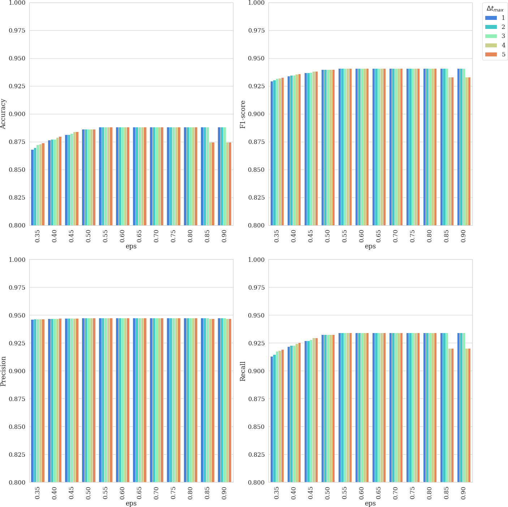
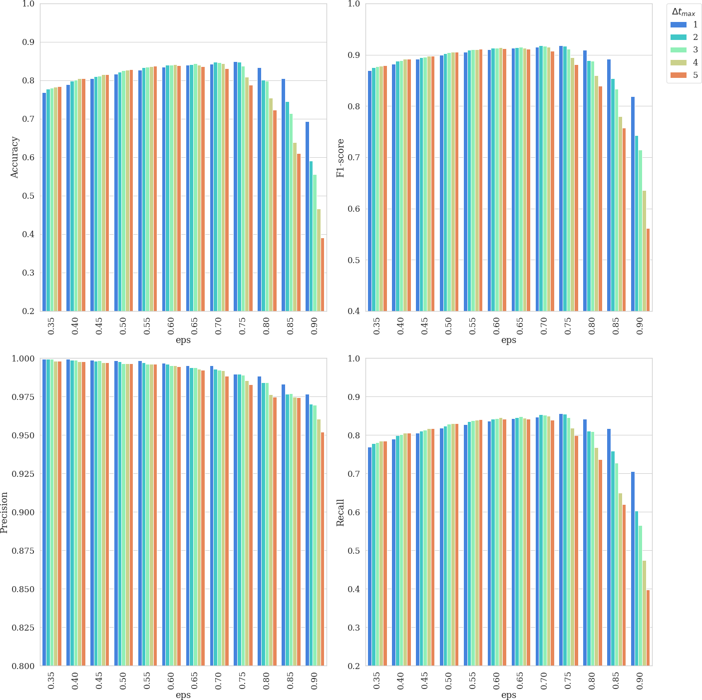

# Deep learning pipeline for yeast cell segmentation and tracking 

 In this pipeline we created synthetic brightfield images of yeast cells and trained a Mask-RCNN model on them. Then we used the trained network on real time-series brightfield microscopy data to automaticly segment and track budding yeast cells.

# Participants

* MSc Herbert Teun Kruitbosch, data scientist, University of Groningen, Data science team
* MSc Yasmin Mzayek, IT trainee, University of Groningen, Data Science trainee
* MA Sara Omlor, IT trainee, University of Groningen, Data Science trainee
* MSc Paolo Guerra, PhD student, University of Groningen, Faculty of Science and Engineering
* Dr Andreas Milias Argeitis, principal investigator, University of Groningen, Faculty of Science and Engineering

# Project description

**Goals** 
* To create synthetic image data to train a deep convolutional neural network
* To implement an automatic segmentation pipeline using this network
* To track cells across time frames

# Get started on Google Colab

We've tried to make our experiments outsider accessible, particularly by setting up the installation for `detectron2` in Google Colab and by downloading all external resources when needed. Please note that in these notebooks the first cells install all dependencies, this should work without restarting. However, try restarting via the Colab Runtime menu on errors, since inappropriate versions might have been imported into the runtime before the appropriate ones were installed. Particularly the `Train model on synthetic data` might require this. For the other notebooks not restarting will unlikely cause issues.

 * [ Example cell detection (several minutes)](https://colab.research.google.com/github/ymzayek/yeastcells-detection-maskrcnn/blob/master/notebooks/example_pipeline.ipynb)
 * [ Evaluation and hyperparameter tuning for segmentation and tracking (~ 30-200 minutes)](https://colab.research.google.com/github/ymzayek/yeastcells-detection-maskrcnn/blob/master/notebooks/evaluation_and_calibration.ipynb)

These two notebooks allow you to create synthetic data and train a model. For a proof of concept, respectively set the `sets` and `max_iter` parameters to the lower values suggested. If you want to run them for a realistic use-case, please know these scripts take several hours to complete, and Google Colab is not intended for this. The results are large (~0.5 - 2GB) and on Colab you might easily fail to safe guard them when Google Colab shuts down the machine due to inactivity.

 * [ Create synthetic data set  (8 hours)](https://colab.research.google.com/github/ymzayek/yeastcells-detection-maskrcnn/blob/master/notebooks/create_synthetic_dataset_for_training.ipynb)
 * [ Train model on synthetic data (8 hours)](https://colab.research.google.com/github/ymzayek/yeastcells-detection-maskrcnn/blob/master/notebooks/train_mask_rcnn_network.ipynb)

# Implementation

 * [ Example cell detection (several minutes)](https://colab.research.google.com/github/ymzayek/yeastcells-detection-maskrcnn/blob/master/notebooks/example_pipeline.ipynb)

For creating the synthetic data set and training the network see the notebooks [create_synthetic_dataset_for_training](https://github.com/ymzayek/yeastcells-detection-maskrcnn/blob/main/notebooks/create_synthetic_dataset_for_training.ipynb) and [train_mask_rcnn_network](https://github.com/ymzayek/yeastcells-detection-maskrcnn/blob/main/notebooks/train_mask_rcnn_network.ipynb).

For segmentation and tracking on real data see [example pipeline](https://github.com/ymzayek/yeastcells-detection-maskrcnn/tree/main/notebooks/example_pipeline.ipynb) notebook.

All the notebooks can be run on Google Colab and automatically install and download all needed dependencies and data (see links above).   

(To run the Mask-RCNN locally, you will need to install the [Detecron2 library](https://detectron2.readthedocs.io/en/latest/tutorials/install.html). For a guide to a Window's installation see these [instructions](https://ivanpp.cc/detectron2-walkthrough-windows/). You also need to download the trained model file from https://datascience.web.rug.nl/models/yeast-cells/mask-rcnn/v1/model_final.pth)

## Segmentation: `get_segmentation`, `get_model`
* **Input** Brightfield time-lapse images. The source file is either a tiff stack or multiple tiff files forming the time-series.

* **Output** A dataframe with one row for each detection and `# detections` $\times$ `height` $\times$ `width` `numpy.ndarray` with the boolean segmentation masks, the masks and the dataframe have the same length and the `mask` column refers to the first dimension of the masks array. The dataframe also has columns `frame`, `x` and `y` to mark the frame of the source image and the centroid of the detection.

<table>
  <tr>	
    <td>
        
    </td>
  </tr>
    <tr>
    <td>Figure 1. Example of 512x512 brightfield images and their detections. Detected yeast cells are highlighted by a magenta border. A) shows the segmentations in one frame of time-series agarpad experiments, B) shows segmentations in microfluidic experiments and C) shows segmentations in an experiment with mutants. </td>
  </tr>
</table>

 

## Tracking: `track_cells`
* **Input** Besides the dataframe and masks from segmentation, tracking needs hyperparameters for the DBSCAN clustering and the maximum frame distance when determining the distances between detections. You can set a maximum frame distance of `<dmax>` for the algorithm to use to calculate the distances between detections in the current `frame` and both `frame-dmax`, `frame+dmax`. In other words, this will calculate distances between all instances in a current frame and all the instances in the following and previous frames up to `dmax`. A higher `dmax` could control for intermittent false negatives because if a cell is missed in an andjacent frame but picked up again 2 frames ahead, the cell will be tracked. However, this also increases the probability of misclassification due to cell growth and movement with time if you look ahead too far. The `min_samples` and `eps` variables are required arguments for the DBSCAN algorithm. For further explanation see [sklearn.cluster.DBSCAN](https://scikit-learn.org/stable/modules/generated/sklearn.cluster.DBSCAN.html).

* **Output** The cell column is added to the dataframe of detections, which is -1 if the tracking algorithm marked it as an outlier and hence didn't track it.

<table>
  <tr>	
    <td>
        
    </td>
  </tr>
    <tr>	
    <td>
        
    </td>
  </tr>
    <tr>
    <td>Figure 2. Segmented and tracked yeast cells from Mask-RCNN. The top movie shows a microfluidic experiment and the botttom movie shows an agarpad experiment. The frame rate of these time-series images is 180 to 300 seconds. </td>
  </tr>
</table>

 

You can visualize the segmentations and tracks in a movie using `visualize.create_scene` and `visualize.show_animation`. Further, you can use `visualize.select_cell` to select a particular cell by label and zoom in on it to observe it better in the movie. The movie displayed with default options gives each cell a unique color that stays the same throughout the movie if the cell is tracked correctly. You also have the options to display the label number by setting the parameter `labelnum` to `True`.

**Information and feature extraction**

This pipeline allows you to extract information about the detected yeast cells in the time-series. The `features.extract_contours` function gives the contour points [x,y] for each segmentation. The masks for all detections can be extracted and their areas can be caulculated as shown in the example pipeline notebook.

 

<table>
  <tr>	
    <td>
        
    </td>
  </tr>
    <tr>
    <td>Figure 3. A mother/daughter pair of masks are overlayed on the original brightfield image.</td>
  </tr>
</table>

 

<table>
  <tr>	
    <td>
        
    </td>
  </tr>
    <tr>
    <td>Figure 4. Comparison of area profiles between mother (blue) and daughter (orange) cells.</td>
  </tr>
</table>

 

Further, if a flourescent channel is available, the pixel intensity of within each cell can also be calculated using the masks segmented on the brightfield images.

<table>
  <tr>	
    <td>
        
    </td>
  </tr>
    <tr>
    <td>Table 1. Example of Mask-RCNN pipeline output.</td>
  </tr>
</table>

 

# Evaluation

 * [ Evaluation and hyperparameter tuning for segmentation and tracking (~ 30-200 minutes)](https://colab.research.google.com/github/ymzayek/yeastcells-detection-maskrcnn/blob/master/notebooks/evaluation_and_calibration.ipynb)

We evaluated our pipeline using benchmark data from the [Yeast Image Toolkit](http://yeast-image-toolkit.biosim.eu/) (YIT) (Versari et al., 2017). On this platform, several exisiting pipelines have been evaluated for their segmentation and tracking performance. We tested our pipeline and that of YeaZ (Dietler et al., 2020) on several test sets from this platform. 

 

<table>
  <tr>	
    <td>
        
    </td>
  </tr>
    <tr>
    <td>Figure 5. The 7 test sets we evaluated from YIT. The images show the first frame of time-series data. These test sets cover sparse, intermediate, and large colonies. For each test set, the image on the left shows the original brightfield image and the image on the right shows the same image with the segmentations output by our network highlighted in magenta.</td>
  </tr>
</table>  

 

We chose to compare our pipeline with YeaZ because they also use a deep learning CNN, unlike the other pipelines evaluated on YIT. 

The YeaZ segmentation and tracking output was obtained by using the [YeaZ-GUI](https://github.com/lpbsscientist/YeaZ-GUI) with the recommended default parameters.

We matched the centroids provided in the benchmark ground truth data to the mask outputs of our pipeline and YeaZ. This is slightly different than the way it was done on the evaluation platform of YIT but comparable since they matched centroids of the prediction to the centroids of the ground truth using a maximum distance threshold to count a comparison as a true positive (see their [EP](https://github.com/Fafa87/EP) for more detail). We then calculated precision, recall, accuracy, and the F1-score.

In the table below, we report the performance metrics for each test set for both YeaZ and our pipeline for comparison.

 

<table>
  <tr>	
    <td>
        
    </td>
  </tr>
    <tr>
    <td>Table 2. Evaluation results from 7 test sets from the YIT. Precision, recall, accuracy, and the F1-score of the performance of our pipeline and of YeaZ are reported for both segmentation and tracking.</td>
  </tr>
</table> 

 

# Hyperparameters

For our pipeline, we used calibration curves to set the segmentation threshold score needed by the Mask-RCNN to define the probablity that an instance is a yeast cell. For tracking, we used them to tune the `epsilon` of DBSCAN and `dmax`, the maximum amount of frames between two detections allowed to adjacently track them as the same cell.

 

<table>
  <tr>	
    <td>
        
        
YIT Test set 1

    </td>
    <td>
        
        
YIT Test set 2

    </td>
  </tr>
  <tr>	
    <td>
        
        
YIT Test set 3

    </td>
    <td>
        
        
YIT Test set 4

    </td>
  </tr>
  <tr>	
    <td>
        
        
YIT Test set 5

    </td>
    <td>
        
        
YIT Test set 6

    </td>
  </tr>
  <tr>	
    <td>
        
        
YIT Test set 7

    </td>
    <td>
    </td>
  </tr>
    <tr>
    <td colspan="2">Figure 6. Calibration curves for each test set showing the 4 different metrics against the segmentation threshold score.</td>
  </tr>
</table>

 

<table>
  <tr>	
    <td>
        
        
YIT Test set 1

    </td>
    <td>
        
        
YIT Test set 3

    </td>
    <td>
        
        
YIT Test set 5

    </td>
    <td>
    </td>
  </tr>
    <tr>
    <td colspan="3">Figure 7. Calibration curves for tracking performance and hyperparameter tuning.</td>
  </tr>
</table>

 
