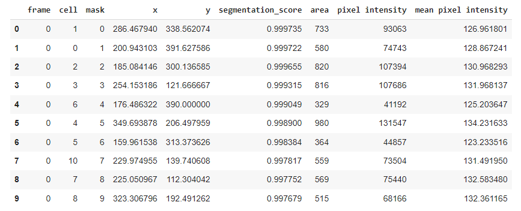

# Yeast Cell Segmentation and Tracking Pipeline

Automatic segmentation and tracking of budding yeast cells in time-series brightfield microscopy images using a mask R-CNN

# Participants

* Dr Andreas Milias Argeitis, principal investigator, University of Groningen, Faculty of Science and Engineering
* MSc Paolo Guerra, second principal investigator, University of Groningen, Faculty of Science and Engineering
* MSc Herbert Teun Kruitbosch, data scientist, University of Groningen, Data science team
* MSc Yasmin Mzayek, IT trainee, University of Groningen, Data Science trainee
* MA Sara Omlor, IT trainee, University of Groningen, Data Science trainee

# Project description

**Goals** 
* To implement an automatic segmentation pipeline using a mask R-CNN trained on synthetic brightfield data. 
* To track cells across time frames using DBSCAN clustering based on intersection-over-union

See https://github.com/prhbrt/synthetic-yeast-cells for the synthetic training data toolkit used to train the mask R-CNN.

# Implementation

See example [pipeline notebook](https://git.webhosting.rug.nl/P301081/yeastcells-detection-maskrcnn/src/branch/master/notebooks/example_pipeline.ipynb).
The example pipeline gives segmentation and tracking results of brightfield time-lapse yeast microscopy.

**Segmentation** 
* **Input** Brightfield 512x512 time-lapse images. The source file is a multi-image tiff. (For reading multiple single-image tiffs and concatenating them use `data.read_image_cat` function instead). The frame rate is 180 to 300 seconds. 

* **Output** The `output` variable provides a prediction box, prediction score, and a prediction mask for each instance segmentation in each frame. You can access the prediction masks by `np.array(output[<frame>]['instances'].pred_masks.to('cpu'))`.

<table>
  <tr>	
    <td>
        
    </td>
  </tr>
    <tr>
    <td>Figure 1. Example of input brightfield images and their detections. Detected yeast cells are highlighted by a purple border. A) shows the segmentations in one frame of a time-series of agarpad experiments, B) shows segmentations in microfluidic experiments and C) shows segmentations in an experiment with mutants.</td>
  </tr>
</table>

**Tracking**  
* **Input** The tracking results are obtained by applying the `clustering.cluster_cells` function on the `output` which uses DBSCAN to cluster the detections into labels representing the same cell over time. You can set a maximum time-distance of `<dmax>` frames for the algorithm to look at ahead and behind that current frame. This will calculate distances between instances in the current frame and the following and previous frames up to dmax. A higher dmax could control for intermittent false negatives because if a cell is missed in the following frame but picked up again 2 frames ahead, the cell will be tracked. However, this also increases the porbability of misclassification due to cell growth and movement with time if you look ahead too far. The `min_samples` and `eps` variables are required arguments for the DBSCAN algorithm. For further explanation see [sklearn.cluster.DBSCAN](https://scikit-learn.org/stable/modules/generated/sklearn.cluster.DBSCAN.html).
* **Output** A list of `labels` and a list of their `coordinates` [time,y,x]. The labels give the same number (starting from 0) to the cells that are the same over time. -1 indicates noise.

<table>
  <tr>	
    <td>
        
    </td>
  </tr>
    <tr>	
    <td>
        
    </td>
  </tr>
    <tr>
    <td>Figure 2. Segmented and tracked yeast cells from mask R-CNN. Top movie shows a microfluidic experiment and the botttom movie shows an agarpad experiment. </td>
  </tr>
</table>

You can visualize the segmentations and tracks in a movie using `visualize.create_scene` and `visualize.show_animation`. Further, you can use `visualize.select_cell` to select a particular cell by label and zoom in on it to observe it better in the movie. The movie displayed with default options gives each cell a unique color that stays the same throughout the movie if the cell is tracked correctly. You also have the options to display the label number by setting the parameter `labelnum` to `True`.

**Infomration and feature extraction**

This pipeline allows you to extract infomration about the detected yeast cells in the time-series. The `features.group` function groups the segmentations by frame. You can use the `features.get_seg_track` function to find the number of segmentations and number of tracked cells (in total or by frame). The `features.extract_contours` function gives the contour points [x,y] for each segmentation. The `features.polygons_per_cluster` function uses the [Shapely](https://shapely.readthedocs.io/en/stable/manual.html) polygon class to output polygons for each label. The polygon class can be used to extract the area in pixels of the polygon and plot it over time. The masks for all segmented cell can be extracted using the function `features.get_masks`. The polygon boundry and mask of a particular cell can be plotted over the brightfield image using `visualize.plot_polygon_mask` as shown in the figure below.

<table>
  <tr>	
    <td>
        
    </td>
  </tr>
  <tr>	
    <td>
        
    </td>
  </tr>
    <tr>
    <td>Figure 3. The top image shows a zoomed in brightfield image with the mask and polygon boundery overlayed on a single segmented instance. The bottom graph shows the area profile of the selected yeast cell.</td>
  </tr>
</table>

<table>
  <tr>	
    <td>
        
    </td>
  </tr>
    <tr>
    <td>Figure 4. Comparison of area profiles between mother (blue) and daughter (orange) cells.</td>
  </tr>
</table>

Further, you can get the average growth rate and the standard deviation of the area and position of the tracked cells. These features can possibly be used in future work for false positive removal and differentiating between mother and daughter cells.

<table>
  <tr>	
    <td>
        
    </td>
  </tr>
    <tr>
    <td>Table 1. Example of Mask R-CNN pipeline output.</td>
  </tr>
</table>

# Evaluation

See [evaluation notebook](https://git.webhosting.rug.nl/P301081/yeastcells-detection-maskrcnn/src/branch/master/notebooks/example_evaluation.ipynb). 

We evaluated our pipeline using benchmark data from the [Yeast Image Toolkit](http://yeast-image-toolkit.biosim.eu/) (YIT) (Versari et al., 2017). On this platform, several exisiting pipelines have been evaluated for their segmentation and tracking performance. We tested our pipeline and that of YeaZ (Dietler et al., 2020) on several test sets from this platform. 

<table>
  <tr>	
    <td>
        
    </td>
  </tr>
    <tr>
    <td>Figure 5. The 7 test sets we evaluated from YIT. The images show the first frame of time-series data. These test sets cover sparse, intermediate, and large colonies. </td>
  </tr>
</table>  

We chose to compare our pipeline with YeaZ because they too use a deep learning CNN, unlike the other pipelines evaluated on YIT. 

The YeaZ segmentation and tracking output was obtained by using the [YeaZ-GUI](https://github.com/lpbsscientist/YeaZ-GUI) with the recommended default parameters.

We matched the centroids provided in the benchmark ground truth data to the mask outputs of our pipeline and YeaZ. This is slightly different than the way it was done on the evaluation platform of YIT but comparable since they matched centroids of the prediction to the centroids of the ground truth with a maximum distance threshold to count as a true positive (see their [EP](https://github.com/Fafa87/EP) for more detail). We then calculated precision, recall, accuracy, and the F1-score.

For our pipeline, we used calibration curves to set the segmentation threshold score needed by the mask R-CNN to define the probablity that an instance is a yeast cell.

<table>
  <tr>	
    <td>
        
    </td>
  </tr>
    <tr>
    <td>Figure 6. Calibration curves for each test set plotting 4 different metrics against the segmentation threshold score.</td>
  </tr>
</table>

In the table below, we report the performance metrics for each test set for both YeaZ and our pipeline for comparison.

<table>
  <tr>	
    <td>
        
    </td>
  </tr>
    <tr>
    <td>Table 2. Evaluation results from 4 test sets from the YIT. Precision, recall, accuracy, and the F1-score of the performance of our pipeline and of YeaZ are reported for both segmentation and tracking.</td>
  </tr>
</table> 

# Future work
### **False positive removal**
False positives can appear in the microscopy images due to several reasons, such as trapped dirt or dust or the presence of dead cells. To control for this we will set up a random forest trained on several features of the yeast cells. This will allow us to automatically remove false positives from the segmentation output. It could also support the setting of a standard and low segmentation threshold score that will allow for many false positives, which can then be easily removed. This would standardize the process of searching for the best threshold to use for segmentation and ensure that a too strict threshold that would miss true positives is not chosen. For this step, however, we need labeled training data, which can potentially be set up through the synthetic training data toolkit.

### **Geneology**
* 

